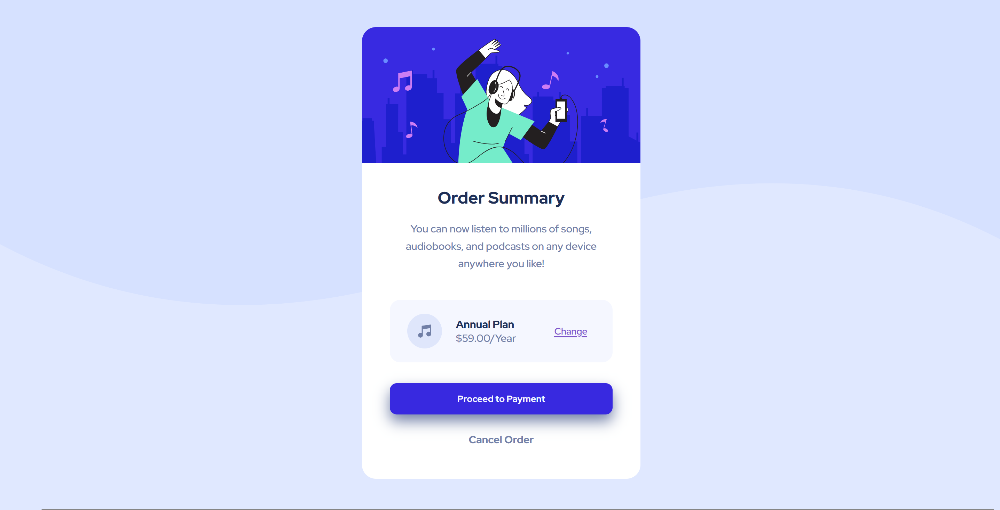

# Frontend Mentor - Order summary card solution

This is a solution to the [Order summary card challenge on Frontend Mentor](https://www.frontendmentor.io/challenges/order-summary-component-QlPmajDUj). Frontend Mentor challenges help you improve your coding skills by building realistic projects. 

## Table of contents

- [Overview](#overview)
  - [The challenge](#the-challenge)
  - [Screenshot](#screenshot)
  - [Links](#links)
- [My process](#my-process)
  - [Built with](#built-with)
  - [What I learned](#what-i-learned)
  - [Continued development](#continued-development)
  - [Useful resources](#useful-resources)
- [Author](#author)
- [Acknowledgments](#acknowledgments)

## Overview

### The challenge

Users should be able to:

- See hover states for interactive elements

### Screenshot

## My process

### Built with

- Semantic HTML5 markup
- CSS custom properties
- Flexbox
- CSS Grid
- Mobile-first workflow

### What I learned

The most difficult part for me was to create a background image without its property overlapping without elements, and in this difficulty I learned properties that helped me to solve this issue such as position, z-index, and more.

### Continued development

In my future projects I will be focusing on integrating multiple elements to create a more interactive display. 

### Useful resources

- [Overlay Div](https://www.youtube.com/watch?v=HFG3BKOqOlE) - This helped me understand more how div's work along with the its capability to be overlayed. The video provides simplified context to better visualize div positioning property.

## Author

- Frontend Mentor - [@YangJ10110](https://www.frontendmentor.io/profile/yourusername)
- Twitter - [@e_more_edge](https://twitter.com/e_more_edge)

## Acknowledgments

This project would not be accomplished by myself without the hardworking and knowledgable tech masters from youtube providing free and accessible resources

Special thanks to: [Kevin Powell](https://www.youtube.com/watch?v=HFG3BKOqOlE) For great CSS content

A lot of thanks also to my girlfriend for the endless support to my learning journey.
